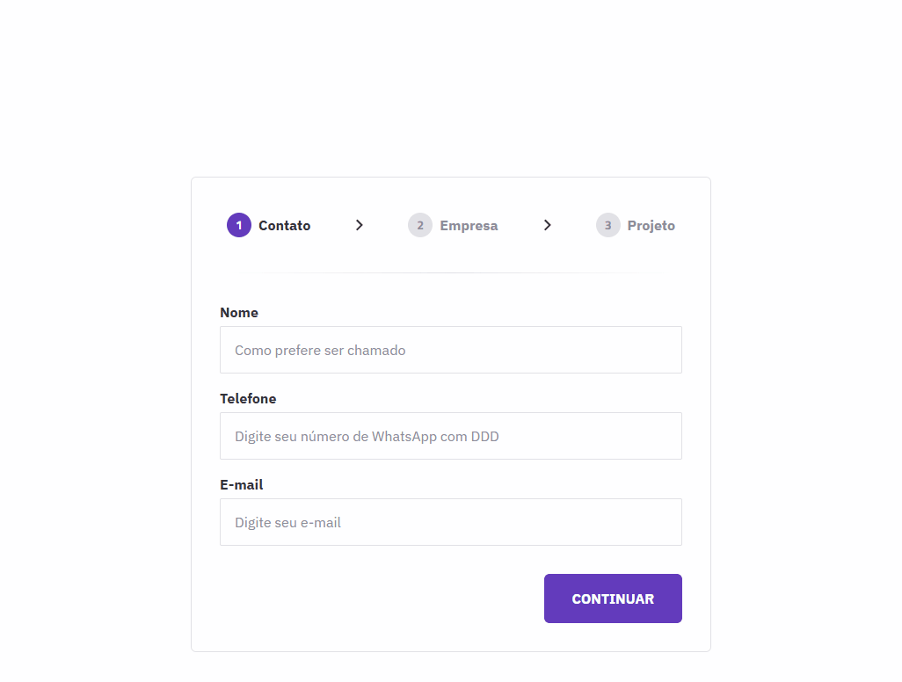

# MultistepForm




## Sobre o projeto

Este projeto é uma aplicação Angular(v19) que implementa um formulário multi-etapas com validação de campos, estilização personalizada e uma experiência de usuário fluida. Abaixo estão os principais destaques do código e da arquitetura do projeto.

## Funcionalidades

### 1. **Formulário Multi-Etapas**
O componente [`MultistepFormComponent`](src/app/components/multistep-form/multistep-form.component.ts) gerencia um formulário dividido em três etapas. Cada etapa possui validações específicas e mensagens de erro amigáveis para o usuário.

- **Validações Personalizadas**: Cada campo do formulário possui validações específicas, como o número mínimo de caracteres para o telefone e validação de e-mail.
- **Mensagens de Erro Dinâmicas**: O método `getErrorMessage` fornece mensagens de erro dinâmicas e localizadas para cada campo.

### 2. **Diretiva de Formatação de Telefone**
A diretiva [`FormatPhoneDirective`](src/app/shared/directives/format-phone.directive.ts) formata automaticamente os números de telefone enquanto o usuário digita, garantindo uma entrada consistente e amigável.

- **Reposicionamento do Cursor**: A diretiva mantém o cursor na posição correta mesmo após a formatação.
- **Suporte a Diferentes Formatos**: Adapta-se dinamicamente ao comprimento do número de telefone.

### 3. **Componentes Reutilizáveis**
O projeto utiliza componentes reutilizáveis para melhorar a modularidade e a manutenibilidade do código:

- [`StepsComponent`](src/app/components/steps/steps.component.ts): Exibe visualmente o progresso do formulário com estados de etapa (ativa, concluída, etc.).
- [`StepsButtonComponent`](src/app/components/steps-button/steps-button.component.ts): Gerencia os botões de navegação entre as etapas.
- [`FormFieldComponent`](src/app/components/form-field/form-field.component.ts): Simplifica a criação de campos de formulário com suporte a validações e mensagens de erro.

### 4. **Estilização com SCSS**
O projeto utiliza SCSS para criar estilos reutilizáveis e consistentes:

- **Mixins Personalizados**: O arquivo [`variables.scss`](src/variables.scss) define mixins como `font-default` e `button`, que são amplamente utilizados para garantir consistência visual.
- **Animações Suaves**: O botão de envio exibe uma animação de carregamento enquanto o formulário está sendo enviado.

### 5. **Experiência do Usuário**
- **Feedback Visual**: Estados como "submetendo" são claramente indicados ao usuário.
- **Mensagens de Sucesso**: Após o envio do formulário, o usuário recebe uma mensagem de confirmação.

## Como Executar o Projeto

1. Instale as dependências:
   ```bash
   npm install
   ```

2. Inicie o servidor de desenvolvimento:
   ```bash
   npm start
   ```

3. Acesse a aplicação em [http://localhost:4200](http://localhost:4200).

## Como Executar o Projeto

1. Instale as dependências:
   ```bash
   npm install
   ```

2. Inicie o servidor de desenvolvimento:
   ```bash
   npm start
   ```

3. Acesse a aplicação em [http://localhost:4200](http://localhost:4200).

## Conclusão

Este projeto demonstra como criar uma aplicação Angular moderna e bem estruturada, com foco em modularidade, reutilização de código e uma experiência de usuário aprimorada. A implementação de recursos como a diretiva de formatação de telefone e os componentes reutilizáveis são exemplos de boas práticas que podem ser aplicadas em outros projetos.
